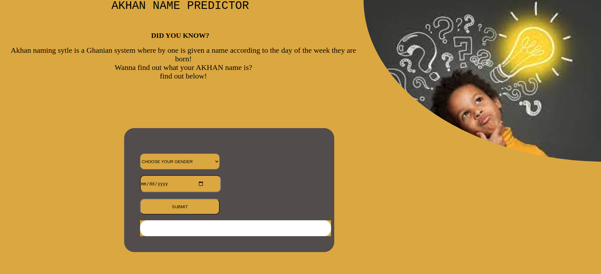

### PROJECT NAME
Akhan Name Predictor.
## SCREENSHOT

### PROJECT DESCRIPTION
This is a simple program that takes in the user date of birth and gender. It then calculates the day of the week they were born and asigns an akhan nameto the user.
Akhan names are related to a Ghanian naming system whereby one is named after the day of the week they were born.

### AUTHORS INFORMATION
Author: Lucy Mongwe

### PROJECT SETUP INSTRUCTIONS
- Open terminal {Ctrl +Alt + T}
- git clone https://github.com/lcmongwe/Akhan-name-predictor.git
- cd akhan-names
- code . or atom . depending on your text editor

### BDD
> Enter your birthday and select your gender.
> The program the checks for conditions to match your data and out puts results.
> If you do not choose your gender or birthday the program gives you an alert to enter the values since they are required.
 if your data is correctly matched you get a true value output .
 - Example : Hey! your akhan name is Kwasi and you were born on monday (if your gender is male)
           OR  Hey! your akhan name is  Akosua and you were born on monday(if your gender is female)

### TECHNOLOGIES USED
- HTML5
- CSS
- JavaScript
- MARKDOWN

### :telephone_receiver: CONTACT INFORMATION
Have any questions? reach me on:
1. Twitter : @lucy_Mongwe
2. faceboook : Lucy Mongwe
3. Email : lcmongwe@gmail.com

### LICENSE AND COPYRIGHT INFORMATION
MIT License

### LINK TO GITHUB PAGES
> Here is a link to githubpages
[github pages]( https://lcmongwe.github.io/Akhan-name-predictor/ "githubpages")